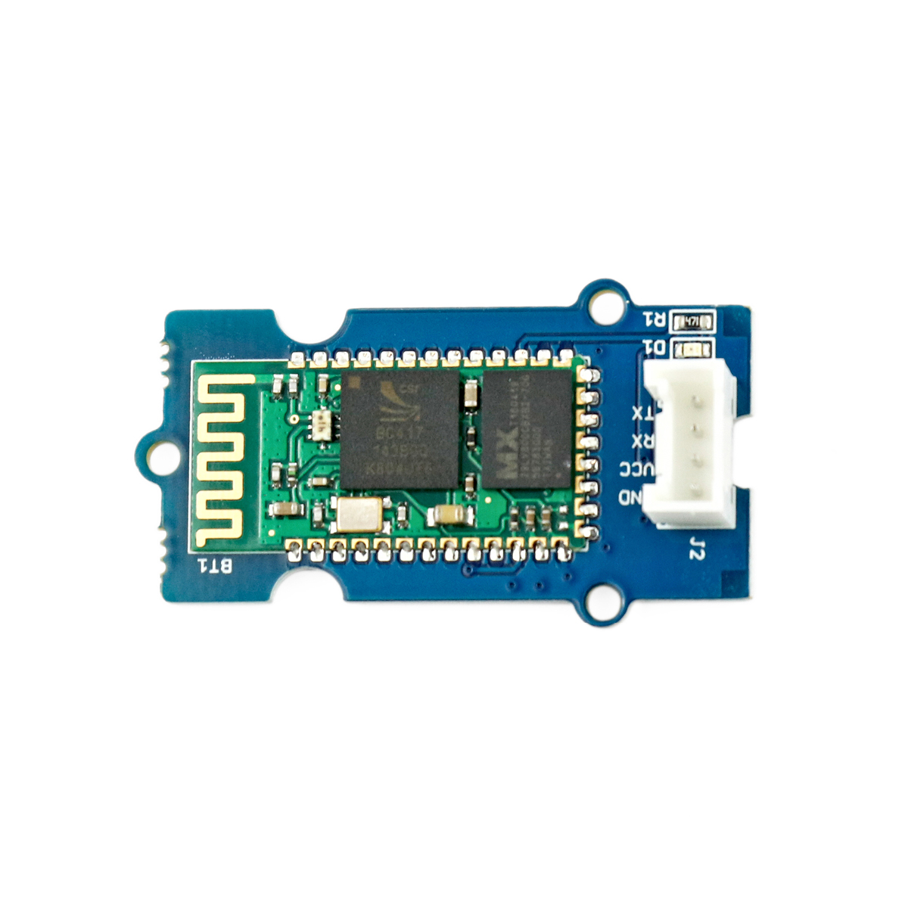

---
title: "Bluetooth-Modul"
date: "2018-10-02T07:01:49.000Z"
tags: 
  - "sensor"
coverImage: "53_bluetooth-modul.jpg"
material_number: "53"
material_type: "sensor"
material_short_descr: "Seeed Studio Grove – Serial Bluetooth V3.0"
manufacture: "Seeed Studio"
manufacture_url: "https://www.seeedstudio.com/"
repo_name: "mks-SeeedStudio-Grove_Serial_Bluetooth_v3.0"
product_url: "http://wiki.seeedstudio.com/Grove-Serial_Bluetooth_v3.0/"
clone_url: "https://github.com/Make-Your-School/mks-SeeedStudio-Grove_Serial_Bluetooth_v3.0.git"
repo_prefix: "mks"
repo_part: "Grove_Serial_Bluetooth_v3.0"
embedded_example_file: "examples/Grove_Serial_Bluetooth_v3.0_minimal/Grove_Serial_Bluetooth_v3.0_minimal.ino"
---

# Bluetooth-Modul

## Beschreibung
Das Bluetooth-Modul ermöglicht es Informationen, Befehle und Daten kabellos zwischen mehreren Endgeräten oder Mikrocontrollern zu übertragen. So können beispielsweise zwei Arduinos untereinander oder auch ein Arduino mit einem Smartphone kommunizieren. Damit das funktioniert, wird auf dem Smartphone ein Terminal benötigt, über das Befehle empfangen und gesendet werden können. Ein Beispiel-Link zu einem solchen Terminal findet ihr unter „Wichtige Links“. Das Bluetooth-Modul lässt sich direkt oder mithilfe des Grove Shields an einen Arduino oder Raspberry Pi über \[simple\_tooltip content='Bei einer seriellen Datenübertragung werden die Bits (Informationen / Kommandos) nacheinander (seriell) über eine Leitung übertragen. Die wichtigsten seriellen Standards im Rahmen der Microcontroller sind I2C (Inter-Integrated Circuit), SPI (Serial Peripheral Interface) und UART (Universal Asynchronous Receiver Transmitter). Die genaue Funktionsweise ist für die reine Nutzung vorerst irrelevant. Es muss allerdings immer geprüft werden an welchen Pins oder an welchen Steckplätzen der jeweilige serielle Anschluss genutzt werden kann. Dies wird in den Datenblättern der Mikrocontroller normalerweise immer mit angegeben.'\]die serielle Schnittstelle UART\[/simple\_tooltip\]  anschließen und zusätzlich über bestimmte Befehle programmieren. So kann beispielsweise ein Bluetooth-Pin oder der angezeigte Bluetooth-Name eingestellt werden.

Alle weiteren Hintergrundinformationen sowie ein Beispielaufbau und alle notwendigen Programmbibliotheken sind auf dem offiziellen Wiki (bisher nur in englischer Sprache) von Seeed Studio zusammengefasst. Zusätzlich findet man über alle gängigen Suchmaschinen meist nur mit der Eingabe der genauen Komponenten-Bezeichnungen entsprechende Projektbeispiele und Tutorials.

<!-- infolist -->

<!-- infolists -->
## Wichtige Links für die ersten Schritte:

- [Seeed Studio Wiki](http://wiki.seeedstudio.com/Grove-Serial_Bluetooth_v3.0/) [- Bluetooth](http://wiki.seeedstudio.com/Grove-Serial_Bluetooth_v3.0/)
- [Google Play Store - Serial Bluetooth Terminal](https://play.google.com/store/apps/details?id=de.kai_morich.serial_bluetooth_terminal&hl=de)

## Projektbeispiele:

- [Funduino - Bluetooth](https://funduino.de/tutorial-hc-05-und-hc-06-bluetooth) (nur ein anderes Modul)

## Weiterführende Hintergrundinformationen:

- [I2C - Wikipedia Artikel](https://de.wikipedia.org/wiki/I%C2%B2C)
- [SPI - Wikipedia Artikel](https://de.wikipedia.org/wiki/Serial_Peripheral_Interface)
- [UART - Wikipedia Artikel](https://de.wikipedia.org/wiki/Universal_Asynchronous_Receiver_Transmitter)
- [Bluetooth - Wikipedia Artikel](https://de.wikipedia.org/wiki/Bluetooth)
- [GitHub-Repository: Bluetooth-Modul](https://github.com/MakeYourSchool/53-Bluetooth-Modul)

