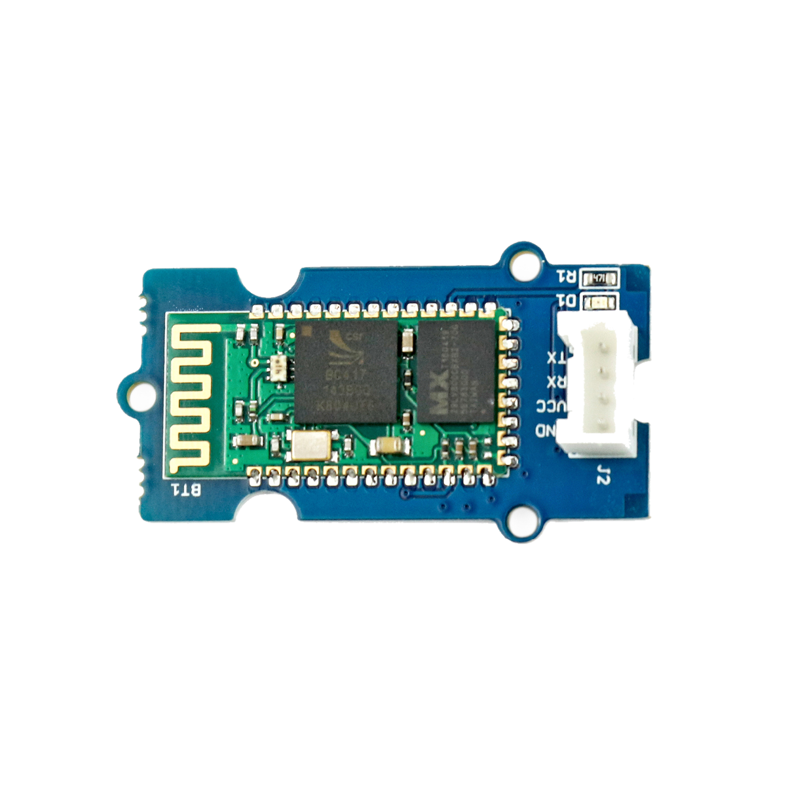

# Bluetooth-Modul



## Beschreibung

Das Bluetooth-Modul ermöglicht es Informationen, Befehle und Daten kabellos zwischen mehreren Endgeräten oder Mikrocontrollern zu übertragen.
So können beispielsweise zwei Arduinos untereinander oder auch ein Arduino mit einem Smartphone / Laptop kommunizieren.

<!-- more_details -->

Damit das funktioniert, wird auf dem Smartphone ein Terminal benötigt, über das Befehle empfangen und gesendet werden können.
Ein Beispiel-Link zu einem solchen Terminal findet ihr unter „Wichtige Links“.
Das Bluetooth-Modul lässt sich direkt oder mithilfe des Grove Shields an einen Arduino oder Raspberry Pi über die serielle Schnittstelle UART anschließen und zusätzlich über bestimmte Befehle programmieren.
So kann beispielsweise ein Bluetooth-Pin oder der angezeigte Bluetooth-Name eingestellt werden.

## Anschlüsse

### Eingang

- UART

### Ausgang

- Bluetooth

## Kurz-Datenblatt

- Signal Eingang: 5V
- Betriebsspannung: 5V
- Fully Qualified Bluetooth `V2.1+EDR`
- Modul-Bezeichnung `HM-01`
- Chip `BC417143`

## library

Um dieses Bauteil zu verwenden, wird lediglich die Bibliothek "SoftwareSerial" benötigt.
(diese ist schon fest in die Arduino IDE integriert - du musst nichts installieren.)

## Beispiel

Der Beispiel-Code ist (vorerst) im Ordner "examples" zu finden.

```c++:./examples/Grove_Serial_Bluetooth_v3.0_.0_minimal/Grove_Serial_Bluetooth_v3.0_.0_minimal.ino
./examples/Grove_Serial_Bluetooth_v3.0_.0_minimal/Grove_Serial_Bluetooth_v3.0_.0_minimal.ino
```

## Anleitungen

Grundsätzlich:

- Bluetooth-Modul am Arduino anschließen (am besten über das Grove Shield).
  Den richtigen Port entnehmt ihr dem Beispiel-Code
- Sobald der Arduino mit Strom versorgt wird, sollte das Bluetooth-Modul anfangen zu blinken.

### Bluetooth-Modul konfigurieren

Das BT-Modul kann über sogenannte AT-Befehle konfiguriert werden. Diese können händisch in der Arduino IDE über den seriellen Monitor verschickt werden. Dies muss nur einmalig gemacht werden. Das Modul speichert die Konfiguration dauerhaft.
Damit das BT-Modul AT-Befehle korrekt verarbeitet müssen drei Bedingungen erfüllt sein:

- Der Beispiel-Code (oder ein vergleichbarer Sketch) muss auf den Arduino aufgespielt sein.
- Der serielle Monitor auf dem PC muss auf "No line ending" eingestellt sein.
- Es darf keine aktive Bluetoothverbindung bestehen (LED muss blinken).

Wenn alles korrekt funktioniert, antwortet das Bluetooth-Modul auf jeden AT-Befehl mit "OK".

Liste der wichtigsten AT-Befehle (Optionen sind in [ ] angegeben (keine Leerzeichen einfügen!)):

| Befehl         | Funktion                                                                          |
| -------------- | --------------------------------------------------------------------------------- |
| AT             | Verbindung testen                                                                 |
| AT+DEFAULT     | Auf Werkszustand zurücksetzen                                                     |
| AT+ROLE[S/M/?] | Slave oder Master aktivieren bzw. aktuelle Einstellung abfragen (Standard: Slave) |
| AT+NAME[.../?] | Name einstellen/abfragen (Standard: HMSoft max. 12 Zeichen)                       |
| AT+PIN[.../?]  | Pin einstellen/abfragen (Standard: 1234)                                          |
| AT+CLEAR       | Letzte Bluetooth-Verbindung löschen                                               |
| AT+TEMP?       | Temperatur des BT-Moduls ausgeben                                                 |
| AT+AUTH[0/1/?] | Authentifizierung einstellen bzw. abfragen (Standard: 0)                          |
| AT+VERSION     | Firmware-Version ausgeben                                                         |
| AT+RESTART     | BT-Modul neu starten                                                              |
| AT+HELP?       | _Hilfe_ anzeigen                                                                  |

#### Beispiele

- Namen abfragen `AT+NAME?`
    - modul antwortet mit `OK+NAME deraktuelle`
- Namen setzen `AT+NAMEFrosch`

### Zwei Bluetooth-Module miteinander verbinden

- Beide Module auf Werkszustand zurücksetzen (oder wie gewünscht konfigurieren. Name, Pin etc. müssen auf beiden Modulen identisch sein!)
- Eines der beiden Module als Master konfigurieren
- Warten. Die beiden Module verbinden sich nun automatisch

### Bluetooth-Modul und Smartphone verbinden

- Bluetooth-Modul auf Werkszustand zurücksetzen (oder wie gewünscht konfigurieren)
- Auf dem Smartphone in die Bluetooth-Einstellungen gehen und nach neuen Geräten suchen. Nach einigen Sekunden sollte das Bluetooth-Modul als "HMSoft" auftauchen.
- "HMSoft" auswählen und PIN eingeben (Standard: 1234)
- In vielen Fällen wird sich das Smartphone zwar koppeln aber keine Verbindung aufbauen können. Das ist nicht schlimm.
- Eine der empfohlenen Bluetooth-Apps öffnen (s. Links zum Google Play Store) und innerhalb der App mit HMSoft verbinden

#### Bluetooth-Apps

- [Google Play Store – Bluetooth Arduino Control](https://play.google.com/store/apps/details?id=com.giristudio.hc05.bluetooth.arduino.control)
- [Google Play Store – Serial Bluetooth Terminal](https://play.google.com/store/apps/details?id=de.kai_morich.serial_bluetooth_terminal&hl=de)
- [F-Droid - Bluetooth Viewer (LITE)](https://f-droid.org/en/packages/net.bluetoothviewer/)
- [F-Droid - SerialTest (kann auch Bluetooth)](https://f-droid.org/en/packages/priv.wh201906.serialtest/)

## Wichtige Links für die ersten Schritte:

- [Seeed Studio Wiki – Bluetooth](http://wiki.seeedstudio.com/Grove-Serial_Bluetooth_v3.0/)

## Projektbeispiele:

- [Funduino – Bluetooth (nur ein anderes Modul)](https://funduino.de/tutorial-hc-05-und-hc-06-bluetooth)

## Weiterführende Hintergrundinformationen:

- [UART - Wikipedia Artikel](https://de.wikipedia.org/wiki/Universal_Asynchronous_Receiver_Transmitter)
- [Bluetooth - Wikipedia Artikel](https://de.wikipedia.org/wiki/Bluetooth)
- [Bluetooth-Chip Software Datasheet](https://files.seeedstudio.com/wiki/Bluetooth_Shield_V2/res/Bluetooth_en.pdf)
